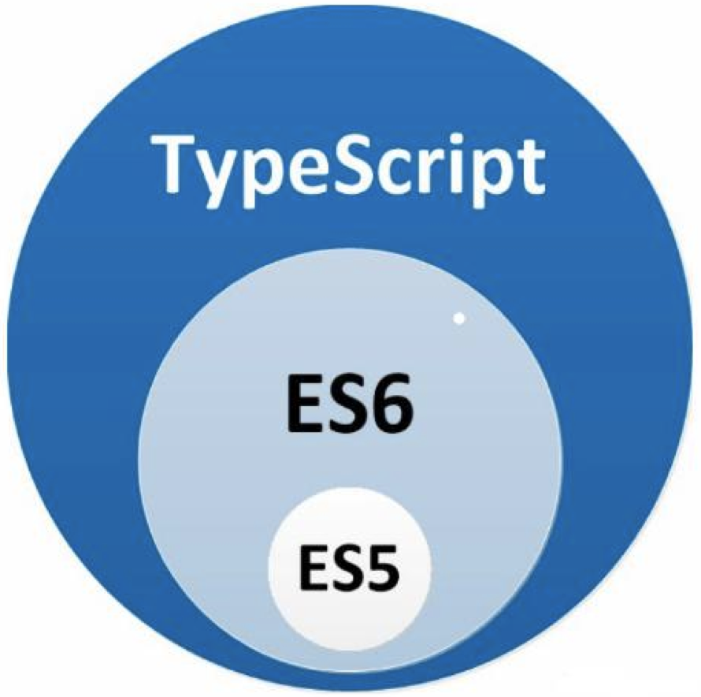
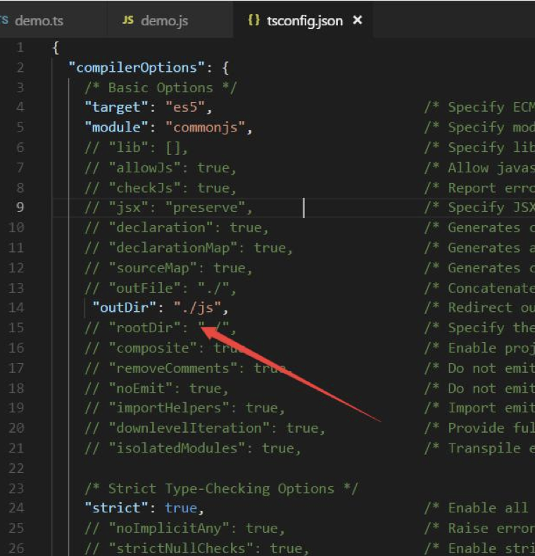
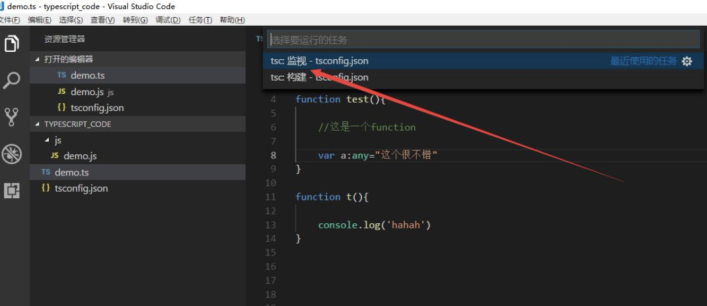
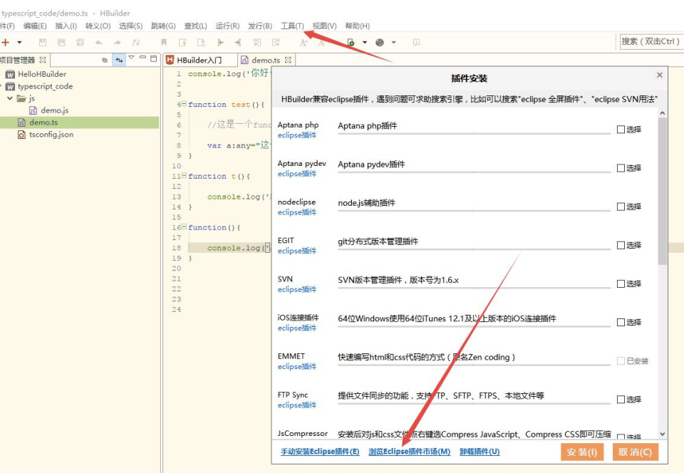
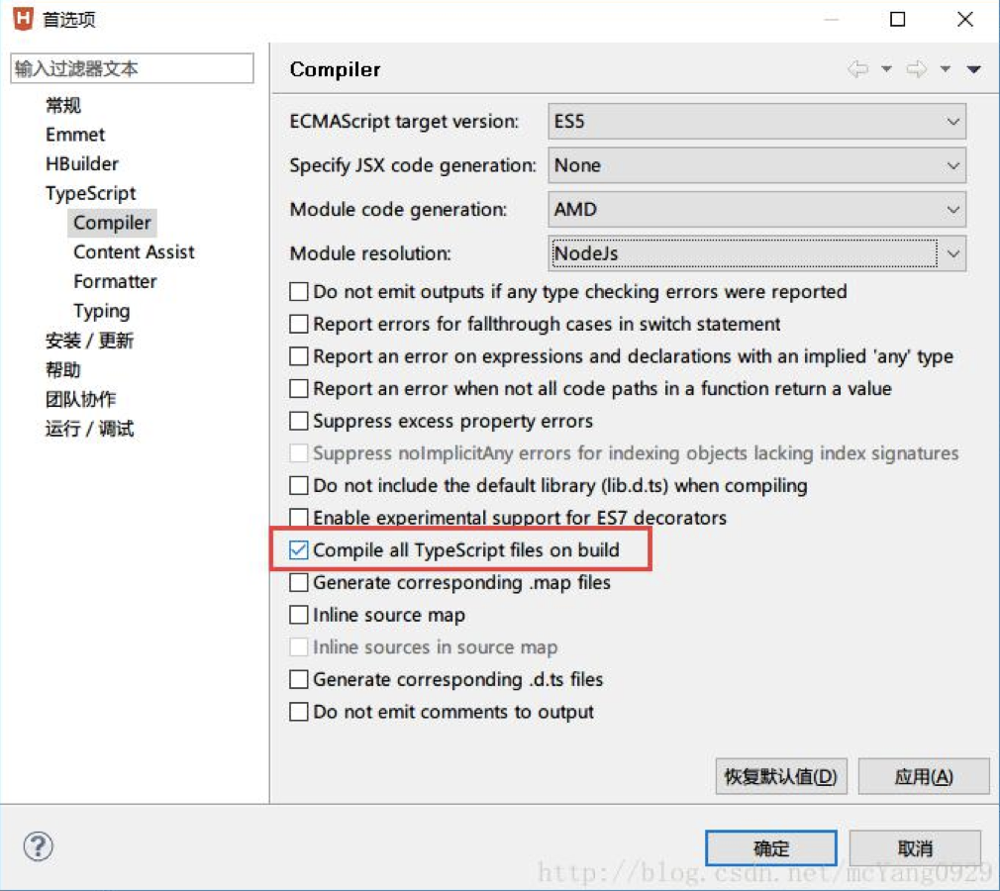

### 一、   Typescript 介绍 

TypeScript  是由微软开发的一款开源的编程语言。 

TypeScript  是  Javascript  的超级，遵循最新的  ES6、Es5  规范。TypeScript  扩展了  JavaScript 的语法。 

TypeScript  更像后端  java、C#这样的面向对象语言可以让  js  开发大型企业项目。 
谷歌也在大力支持  Typescript  的推广，谷歌的  angular2.x+就是基于  Typescript  语法。 
最新的  Vue    、React  也可以集成  TypeScript。



### 二、   Typescript 安装    编译

```bash
npm install -g typescript

tsc helloworld.ts
```

### 三、    Typescript    开发工具    Vscode  自动 编译.ts  文件

1.     创建  tsconfig.json  文件        tsc  --init        生成配置文件



2、点击菜单    任务-运行任务            点击  tsc:监视-tsconfig.json    然后就可以自动生成代码 



### 四、    Typescript    开 发 工 具     HBuilder  自 动编译.ts  文件

1.在最上方菜单栏，点击工具-插件安装；

2.点击下方浏览  Eclipse  插件市场，搜索  typescript  插件进行安装

3.安装完成后重启编译器，点击菜单栏工具-选项        选择编译  ts 文件 

4.在你的项目上右键点击--配置--Enable    TypeScript    Builder，之后你再保存.ts  文件 时会自动在当前目录编译出对应的.js  文件






在  Compile   all   TypeScript   files   on   build  进行打勾，然后确定； 

### 五、typescript中的数据类型

typescript中为了使编写 的 代码更规范，更利于维护，增加了类型校验，在typescript中主要给我们提供了以下数据类型

##### 布尔类型	boolean

```typescript
var flag:boolean = true;
flag=123;  // 错误
flag=false;
console.log(flag);
```

##### 数字类型	number

```stylus
var num:number=123;
num=456;
console.log(num);

num='str';	//错误
```

##### 字符串类型	string

```typescript
var str:string='123';	//错误
var str:string='this is typescript';
str='哈哈';
str=123;	//错误
```

##### 数组类型	array

```typescript
//es5
var arr=['1','2'];
//第一种
var arr:number[]=[11,22,33];
console.log(arr);
//第二种
var arr:Array<number>=[11,22,33];
console.log(arr);
//第三种
var arr:any[]=[123,"哈哈",true];
cosnole.log(arr);
```

##### 元祖类型	tuple	属于数组的一种

```typescript
let arr:[number,string]=[123,'this is ts'];
console.log(arr);
```

##### 枚举类型	enum

随着计算机的不断普及,程序不仅只用于数值计算 ,还更广泛的处理非数值的数据.

例如:性别,月份,星期几,颜色,单位名,学历,职业等.都不是数值数据.

在其他程序设计语言中,一般用一个数值代表某一状态(1 success 0 error)这种处理方法不直观,易读性差.

如果能在程序中用自然语言中有相应含义的单词来代表某一状态,则程序就很容易阅读和理解.

也就是说,事先考虑到某一变量可能取的值,尽管用自然 语言中含义清楚的单词来表示 它的每个值.这种方法称为枚举方法,用这种方法定义的类型 称枚举类型

```typescript
enum 枚举名 {
  标识符[=整型常数],
  标识符[=整型常数],
  ...
  标识符[=整型常数]
}

//如果 标识符没有赋值 , 它的值就是下标
```

```typescript
enum Flag {
  success=1,error=2
};
let f:Flag=Flag.success;
console.log(f);


enum Color {
  blue,red=3,'orange'
};
var c:Color=Color.red;
console.log(c);

enum Err {
  'undefind'= -1,'null'= -2,'success'=1
};
var e:Err=Err.null;
console.log(e);
```

##### 任意类型	any

```typescript
var num:any=123;
num='str';
num=true;
console.log(num);
```

```typescript
var bBox:any = document.getElementById('box');
oBox.style.color = 'red';

//因为ts中并没有Object类型 , 所以:Object会报错,不指定类型也会报错
```

##### null 和 undefined

其他数据类型(never)的子类型

```typescript
 var num:number;
console.log(num);		//报错 undefined

 var num:never;
console.log(num);		//不报错 undefined

var num:number |  undefined;
//num = 123;
console.log(num);

var num:null;
num=123;	//报错
num=null;

var num:number | null | underfined;
num=1234;
console.log(num);
```

##### void类型

typescript中的void表示没有任何类型,一般用于定义方法的时候方法没有返回值

```typescript
function run():void {
  console.log('run');
}
run();


function run():number {
  return 123;
}
run();
```

##### never类型

其它类型(包括 null 和 undefined)的子类型 , 代表从不会出现的值.这意味着声明never的变量只能被never类型所赋值.

 ```typescript
var a:undefined;
a=undefined;

var b:null;
b=null;

var a:never;
a=(()=>{
  throw new Error('错误');
})()
 ```

### 六、TypeScript中的函数

##### 函数的定义

```typescript
//es5定义函数的方法

//函数声明法
function run(){
		return 'run';
}
//匿名函数
var run2=function(){

	return 'run2';
}
```

```typescript
//ts中定义函数的方法
//函数声明法
function run():string{
	return 'run';
}

//错误写法
function run():string{
	return 123;
}
//匿名函数
var fun2=function():number{
     return 123;
}
alert(fun2()); /*调用方法*/
```

```typescript
//ts中定义方法传参

function getInfo(name:string,age:number):string{

  return `${name} --- ${age}`;
}
alert(getInfo('zhangsan',20));


var getInfo=function(name:string,age:number):string{
	return `${name} --- ${age}`;
}
alert(getInfo('zhangsan',40));


//没有返回值的方法
function run():void{
	console.log('run')
}
run();
```

##### 可选参数

```typescript
// es5里面方法的实参和行参可以不一样，但是ts中必须一样，如果不一样就需要配置可选参数 
function getInfo(name:string,age?:number):string{

  if(age){
    return `${name} --- ${age}`;
  }else{
    return `${name} ---年龄保密`;
  }
}

alert(getInfo('zhangsan'));
alert(getInfo('zhangsan',123));

//注意:可选参数必须配置到参数的最后面

//错误写法

function getInfo(name?:string,age:number):string{

  if(age){
    return `${name} --- ${age}`;
  }else{
    return `${name} ---年龄保密`;
  }
}
alert(getInfo('zhangsan'));
```

##### 默认参数

```typescript
// es5里面没法设置默认参数，es6和ts中都可以设置默认参数
function getInfo(name:string,age:number=20):string{

  if(age){
    return `${name} --- ${age}`;
  }else{
    return `${name} ---年龄保密`;
  }
}

// alert( getInfo('张三'));
alert( getInfo('张三',30));
```

##### 剩余参数

```typescript
function sum(a:number,b:number,c:number,d:number):number{
  return a+b+c+d;
}
alert(sum(1,2,3,4)) ;

//三点运算符 接受新参传过来的值
function sum(...result:number[]):number{

  var sum=0;

  for(var i=0;i<result.length;i++){
    sum+=result[i];  
  }
  return sum;
}
alert(sum(1,2,3,4,5,6)) ;


function sum(a:number,b:number,...result:number[]):number{

  var sum=a+b;

  for(var i=0;i<result.length;i++){
    sum+=result[i];  
  }
  return sum;
}
alert(sum(1,2,3,4,5,6)) ;
```

##### 函数重载

java中方法的重载：重载指的是两个或者两个以上同名函数，但它们的参数不一样，这时会出现函数重载的情况。

typescript中的重载：通过为同一个函数提供多个函数类型定义来试下多种功能的目的。

ts为了兼容es5 以及 es6 重载的写法和java中有区别。

```typescript
//es5中出现同名方法，下面的会替换上面的方法 
function css(config){

}

function css(config,value){

}
```

```typescript
//ts中的重载

function getInfo(name:string):string;

function getInfo(age:number):string;

function getInfo(str:any):any{

     if(typeof str==='string'){
         return '我叫：'+str;
     }else{
         return '我的年龄是'+str;
     }

}
alert(getInfo('张三'));   //正确
alert(getInfo(20));   	 //正确
alert(getInfo(true));    //错误写法


function getInfo(name:string):string;
function getInfo(name:string,age:number):string;
function getInfo(name:any,age?:any):any{
  if(age){

    return '我叫：'+name+'我的年龄是'+age;
  }else{

    return '我叫：'+name;
  }
}
alert(getInfo('zhangsan'));  /*正确*/
alert(getInfo(123));  			 //错误
alert(getInfo('zhangsan',20));
```

##### 箭头函数	es6

```typescript
//this指向的问题    箭头函数里面的this指向上下文

setTimeout(function(){
    alert('run')
},1000)


setTimeout(()=>{
  alert('run')
},1000);
```


